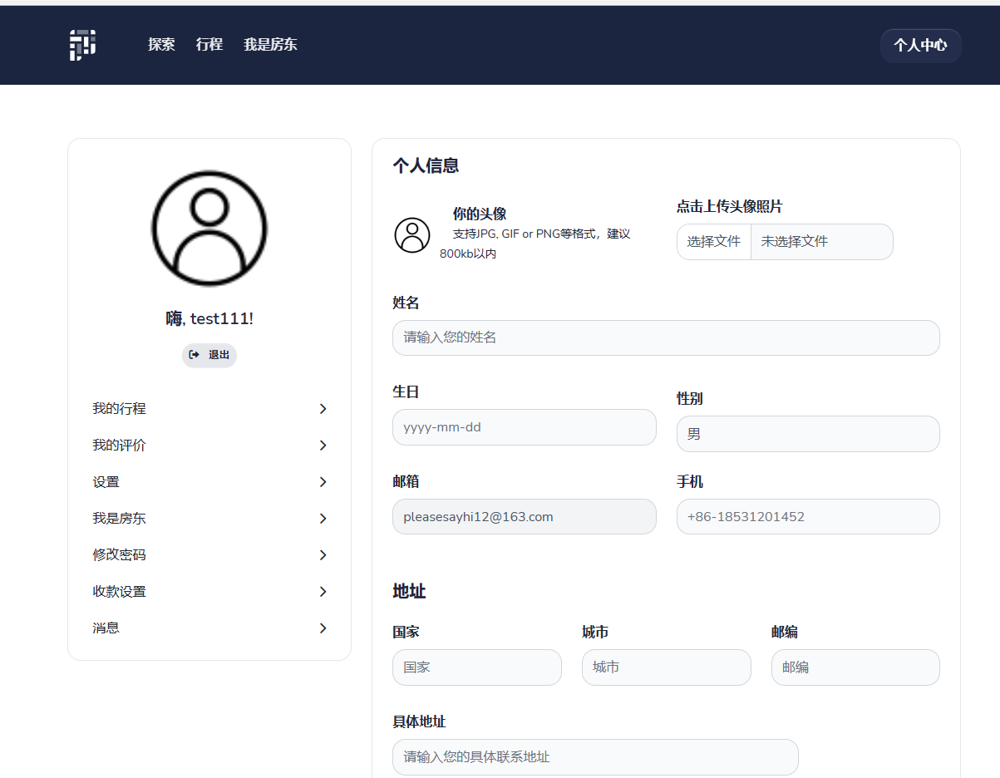

# Flask-Yirbnb-System 游彼迎

> 参考[Airbnb爱彼迎](https://airbnb.com)民宿网站设计开发  微信：bytecola 有偿修改

<br />





> 主要开发语言

- 👉 [Python]() 
- 👉 [Javascript]() 
- 👉 [HTML5]() 

> 所用开源框架

- 👉 [Flask v2.0]() 
- 👉 [Bootstrap v5]()


<br />

## ✨ **[主要功能]()**

- [x] **注册与登录**
- [x] **房源搜索与展示**
- [x] **预定房源**
- [x] **个人中心**:
  - [x] `我的出行订单`
  - [x] `个人基础信息设置与查看`
  - [x] `密码修改`
  - [x] `房东房源发布与管理`
  - [x] `收款账号设置`
- [x] **网站建议收集**

<br />

## ✨ 如何使用


<br />

> 👉 **[安装 Python3](https://www.runoob.com/python/python-install.html)** 


> 👉 **[安装虚拟环境模块](https://docs.python.org/zh-cn/3/library/venv.html)**


> 👉 **创建虚拟环境，安装依赖** 

```bash
$ python -m virtualenv env
$ .\env\Scripts\activate
$
$ # 下载安装依赖 - 默认使用SQLite数据库
$ pip3 install -r requirements.txt
```

<br />

> 👉 **设置环境变量**

```bash
$ # CMD terminal
$ set FLASK_APP=run.py
$ set FLASK_ENV=development
$
$ # Powershell
$ $env:FLASK_APP = ".\run.py"
$ $env:FLASK_ENV = "development"
```

<br />

> 👉 **启动程序**

```bash
$ flask run 
```

程序启动主要页面

- 注册页面: `http://localhost:5000/register`
- 登录页面: `http://localhost:5000/login`

<br />


## ✨ 项目结构

该项目使用blueprints、应用程序工厂模式、多配置配置文件（开发和生产）。项目文件结构如下：

```bash
< PROJECT ROOT >
   |
   |-- apps/
   |    |
   |    |-- home/                          # A simple app that serve HTML files
   |    |    |-- routes.py                 # Define app routes
   |    |
   |    |-- authentication/                # Handles auth routes (login and register)
   |    |    |-- routes.py                 # Define authentication routes  
   |    |    |-- models.py                 # Defines models  
   |    |    |-- forms.py                  # Define auth forms (login and register) 
   |    |
   |    |-- static/
   |    |    |-- <css, JS, images>         # CSS files, Javascripts files
   |    |
   |    |-- templates/                     # Templates used to render pages
   |    |    |-- includes/                 # HTML chunks and components
   |    |    |    |-- navigation.html      # Top menu component
   |    |    |    |-- sidebar.html         # Sidebar component
   |    |    |    |-- footer.html          # App Footer
   |    |    |    |-- scripts.html         # Scripts common to all pages
   |    |    |
   |    |    |-- layouts/                   # Master pages
   |    |    |    |-- base-fullscreen.html  # Used by Authentication pages
   |    |    |    |-- base.html             # Used by common pages
   |    |    |
   |    |    |-- accounts/                  # Authentication pages
   |    |    |    |-- login.html            # Login page
   |    |    |    |-- register.html         # Register page
   |    |    |
   |    |    |-- home/                      # UI Kit Pages
   |    |         |-- index.html            # Index page
   |    |         |-- 404-page.html         # 404 page
   |    |         |-- *.html                # All other pages
   |    |    
   |  config.py                             # Set up the app
   |    __init__.py                         # Initialize the app
   |
   |-- requirements.txt                     # Development modules - SQLite storage
   |-- requirements-mysql.txt               # Production modules  - Mysql DMBS
   |-- requirements-pqsql.txt               # Production modules  - PostgreSql DMBS
   |
   |-- nginx                                # Deployment
   |    |-- appseed-app.conf                # Deployment 
   |
   |-- .env                                 # Inject Configuration via Environment
   |-- run.py                               # Start the app - WSGI gateway
   |
   |-- ************************************************************************
```

<br />


## ✨ 部署


---

[Waitress](https://docs.pylonsproject.org/projects/waitress/en/stable/) 是一个具备生产级品质并有高性能的纯python编写独立的WSGI服务器，它只依赖python标准库，不依赖任何第三方库。

> 通过 pip 安装 Waitress

```bash
$ pip install waitress
```
> Start the app using [waitress-serve](https://docs.pylonsproject.org/projects/waitress/en/stable/runner.html)

```bash
$ waitress-serve --port=8001 run:app
Serving on http://localhost:8001
```

在浏览器访问 `http://localhost:8001` 。程序正常启动运行

<br />

## ✨ 支付宝支付沙箱环境的使用

[支付宝沙箱环境官方文档](https://opendocs.alipay.com/open/02np8i)

## 联系我

